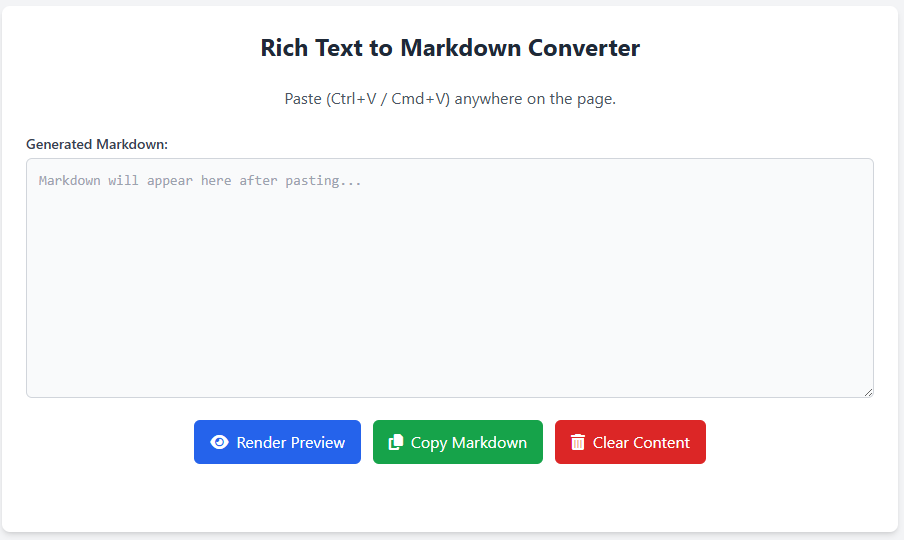
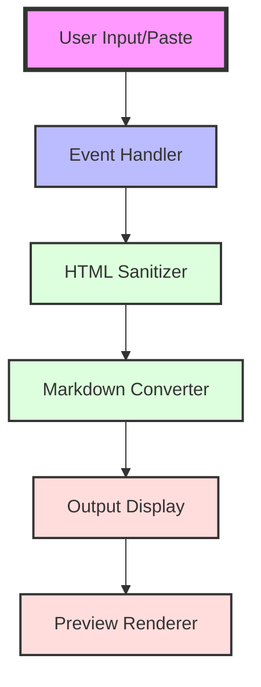
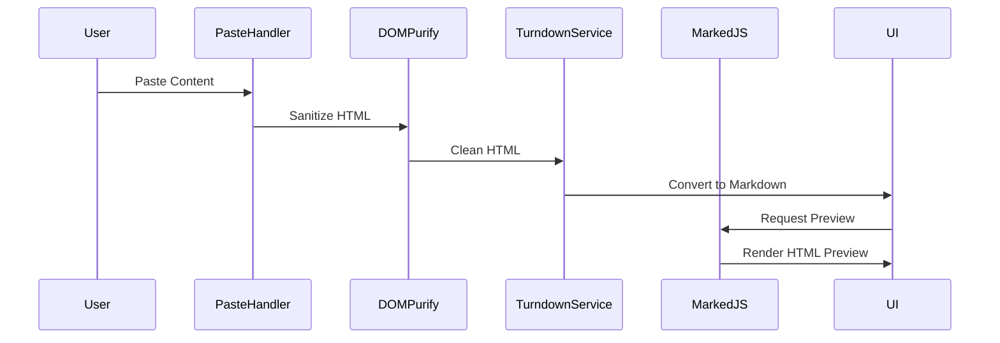
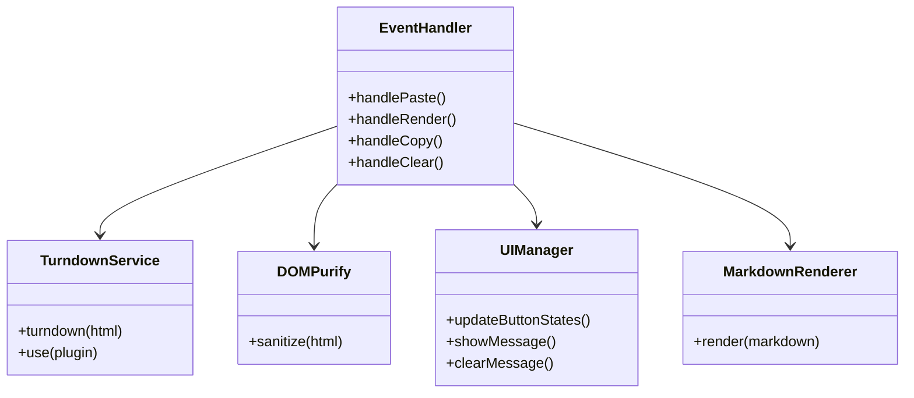

# 📝 Rich Text to Markdown Converter

A sleek, modern web application that instantly converts rich text content into clean, well-formatted Markdown. Perfect for developers, writers, and content creators who work with Markdown.

## ✨ Features

- 🚀 **Instant Conversion**: Paste rich text content and see the Markdown conversion in real-time
- 👁️ **Live Preview**: See how your Markdown will render instantly
- 🔒 **Secure**: Built-in HTML sanitization using DOMPurify
- 📋 **Easy Copying**: One-click copy to clipboard functionality
- 🎨 **Beautiful UI**: Modern, responsive design using Tailwind CSS
- 🔌 **No Backend Required**: Purely client-side implementation
- 🌟 **GitHub Flavored Markdown**: Supports tables, strikethrough, and more

## 🏗️ Architecture

The application follows a clean, event-driven architecture with clear separation of concerns:

### 🔄 Data Flow

## 🛠️ Technical Components

### Core Libraries

- **TurndownJS**: Converts HTML to Markdown
- **DOMPurify**: Sanitizes HTML input
- **MarkedJS**: Renders Markdown preview
- **TailwindCSS**: Handles styling
- **Font Awesome**: Provides icons

### Component Structure

## 🚀 Getting Started

1. Clone the repository
2. Open `index.html` in a modern web browser
3. Start pasting rich text content!

No build process or installation required - it just works!

## 🔧 Browser Support

- ✅ Chrome/Edge (Latest)
- ✅ Firefox (Latest)
- ✅ Safari (Latest)
- ✅ Opera (Latest)

## 🔐 Security Features

- HTML sanitization using DOMPurify
- Script tag removal
- Safe attribute filtering
- XSS protection

## 🎯 Use Cases

1. Converting Word documents to Markdown
2. Cleaning up formatted text for GitHub
3. Converting HTML newsletter content
4. Preparing documentation from rich text

## 🤝 Contributing

Feel free to:
- Open issues
- Submit Pull Requests
- Suggest new features
- Report bugs

## 📜 License

MIT License - feel free to use in your own projects!

---

Made with ❤️ for the Markdown community
